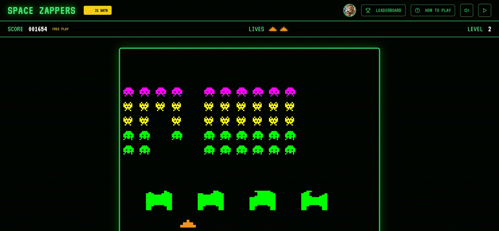

# Space Zappers

A retro Space Invaders arcade game powered by Bitcoin Lightning and Nostr.

Pay 21 sats to play. Publish your high scores to the decentralized leaderboard.



## Features

- **Classic Arcade Gameplay** - Authentic Space Invaders mechanics with pixel art graphics and CRT screen effects
- **Lightning Payments** - Pay 21 sats per game via any Lightning wallet
- **Nostr Leaderboard** - Scores published to Nostr for a censorship-resistant, decentralized high score table
- **Retro Audio** - Chiptune-style music that speeds up as you eliminate invaders
- **Free Play Mode** - Try the game without paying (scores not publishable)

## How to Play

1. **Pay to Play** - Click "Pay 21 Sats" and scan the QR code with your Lightning wallet
2. **Move** - Arrow keys (← →) or A/D
3. **Shoot** - Spacebar
4. **Survive** - Destroy all invaders before they reach you
5. **Compete** - Login with Nostr to publish your score to the global leaderboard

## Tech Stack

- React 18 + TypeScript + Vite
- TailwindCSS + shadcn/ui
- Nostrify (Nostr protocol)
- LNbits (Lightning payments)
- HTML5 Canvas (game rendering)

## Development

```bash
# Install dependencies
npm install

# Start development server
npm run dev

# Run tests and build
npm run test

# Production build
npm run build

# Deploy to Nostr
npm run deploy
```

## Lightning Payment Flow

1. Game generates invoice via Lightning address
2. Unique payment ID embedded in invoice comment
3. User pays with any Lightning wallet
4. LNbits webhook publishes confirmation to Nostr (kind 8550)
5. Game detects payment and starts automatically

See [WEBHOOK.md](./WEBHOOK.md) for webhook setup instructions.

### Wallet Connection (NWC)

Players can connect a Lightning wallet via [Nostr Wallet Connect (NWC)](https://nwc.dev) for one-click payments. The connection is stored in localStorage and persists across browser sessions until manually disconnected.

## Nostr Integration

Space Zappers uses the [Gamestr](https://gamestr.io) protocol for decentralized leaderboards.

### Event Kinds

| Kind | Purpose |
|------|---------|
| 30762 | Game scores ([Gamestr spec](https://gamestr.io/developers)) |

### Architecture

```
┌─────────────────┐     ┌──────────────────┐     ┌─────────────────┐
│   Game Client   │────▶│  Score Service   │────▶│  Nostr Relays   │
│   (Browser)     │     │  (signs scores)  │     │                 │
└─────────────────┘     └──────────────────┘     └─────────────────┘
        │                       │
        │                       │ GAME_NSEC (private)
        ▼                       ▼
   Player pubkey          Game pubkey signs
   identifies user        score events
```

The score service holds the game's private key (nsec) and signs score events on behalf of players. This prevents score spoofing since only the game can publish valid scores.

### Querying Scores

```javascript
// Query by game author pubkey (relays don't index #game tag)
const GAME_PUBKEY = '6c95ab59b0ebf56296f45b8b52b9b0f2599029c173a8c5fd463ef0a474995fcc';
const scores = await nostr.query([
  { kinds: [30762], authors: [GAME_PUBKEY], limit: 100 }
]);
```

See [NIP.md](./NIP.md) for full event specifications.

## Deployment

Single container runs both the game (Nginx) and score signing service (Node.js):

```bash
docker build -t space-zappers .
docker run -d --name space-zappers \
  -p 3001:80 \
  -e GAME_NSEC=nsec1your_game_nsec_here \
  space-zappers
```

The `GAME_NSEC` environment variable is your game's Nostr private key for signing scores.

## Configuration

The game sends payments to a configured Lightning address. To use your own:

1. Edit `src/pages/Game.tsx`
2. Update `RECIPIENT_LIGHTNING_ADDRESS`
3. Set up LNbits webhook (see WEBHOOK.md)
4. Configure `VITE_SCORE_SERVICE_URL` to point to your score service

## Project Structure

```
├── src/
│   ├── pages/Game.tsx           # Main game page
│   ├── components/
│   │   ├── GameCanvas.tsx       # Canvas rendering
│   │   └── ui/                  # shadcn/ui components
│   ├── lib/
│   │   ├── gameEngine.ts        # Game logic
│   │   ├── audioEngine.ts       # Sound system
│   │   └── lightningInvoice.ts  # Invoice generation
│   └── hooks/
│       ├── useGameScores.ts     # Leaderboard queries
│       └── usePaymentConfirmation.ts  # Payment detection
│
└── score-service/               # Score signing microservice
    ├── index.js                 # API server (kind 30762)
    ├── Dockerfile               # Container build
    └── package.json
```

## Credits

Vibed by ninimonk05 • Powered by Lightning

---

Built with [MKStack](https://soapbox.pub/mkstack)
